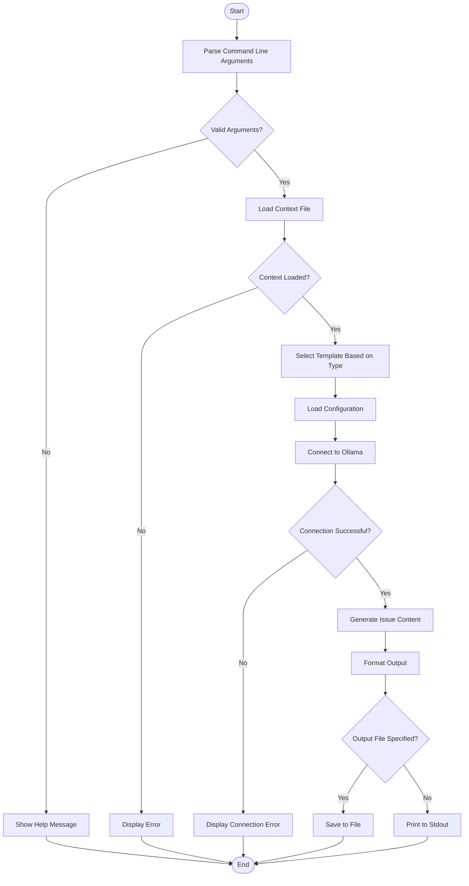

# Issue Generator

A CLI tool that generates formatted issue descriptions from templates using AI (Ollama).

## Features

- Generate different types of issues (epics, stories, documentation)
- Use customizable templates
- Powered by Ollama for intelligent content generation
- Output in different formats (JIRA, AsciiDoc)

## Installation

### Prerequisites

- Python 3.7+
- [Ollama](https://github.com/ollama/ollama) installed and running locally (or accessible via URL)

### Setup

1. Clone this repository:
   ```
   git clone https://github.com/yourusername/create-issues.git
   cd create-issues
   ```

2. Install dependencies:
   ```
   pip install ollama
   ```

## Usage

Basic usage:

```
python cli.py <context-file> [options]
```

Where `<context-file>` is a file containing the context for the issue to be generated.

### Options

- `--type`: Type of issue to generate (`epic`, `story`, `adoc`, or `docs`). Default: `story`
- `--output`: Output file path. If not specified, output is printed to stdout
- `--model`: Ollama model to use. Default: `gemma3:27b`

### Examples

Generate a user story from a context file:
```
python cli.py prompt.txt --type story
```

Generate epic documentation and save it to a file:
```
python cli.py prompt.txt --type epic --output my-epic.txt
```

Use a specific Ollama model:
```
python cli.py prompt.txt --model llama3:8b --output my-issue.txt
```

## Templates

Templates are located in the `templates` directory. The following templates are available:

- `epic_template.txt`: Template for epics
- `story_template.txt`: Template for user stories
- `adoc_template.txt`: Template for AsciiDoc documentation
- `docs_template.txt`: Template for general documentation

## Configuration

System prompts and template configurations can be modified in `issue_generator/prompts-config.json`.

## Workflow

The following activity diagram illustrates the workflow of the CLI tool:


