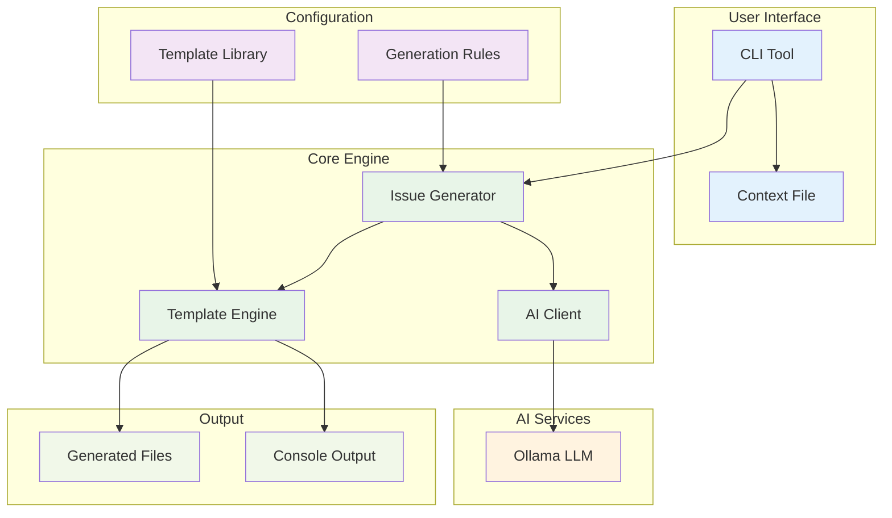

# Template Drafter

A CLI tool that generates formatted issue descriptions from templates using AI (Ollama).

## Features

- Generate different types of issues (epics, stories, documentation)
- Use customizable templates
- Powered by Ollama for intelligent content generation
- Output in different formats (JIRA, AsciiDoc)

## Installation

### Prerequisites

- Python 3.7+
- [Ollama](https://github.com/ollama/ollama) installed and running locally (or accessible via URL)

### Setup

1. Clone this repository:
   ```
   git clone https://github.com/yourusername/template-drafter.git
   cd template-drafter
   ```

2. Install dependencies:
   ```
   pip install -r requirements.txt
   ```

## Usage

Basic usage:

```
python cli.py <context-file> [options]
```

Where `<context-file>` is a file containing the context for the issue to be generated.

### Options

- `--type`: Type of issue to generate (`epic`, `story`, `adoc`, or `docs`). Default: `story`
- `--output`: Output file path. If not specified, output is printed to stdout
- `--model`: Ollama model to use. Default: `gemma3:12b`

### Examples

Generate a user story from a context file:
```
python cli.py prompt.txt --type story
```

Generate epic documentation and save it to a file:
```
python cli.py prompt.txt --type epic --output my-epic.txt
```

Use a specific Ollama model:
```
python cli.py prompt.txt --model llama3:8b --output my-issue.txt
```

## How It Works

Template Drafter follows a modular architecture with clear separation of concerns:

### Core Components

1. **CLI (`cli.py`)**: Entry point that parses arguments and orchestrates the generation process
2. **TemplateManager**: Loads and manages Jinja2 templates and prompt configurations
3. **OllamaClient**: Handles communication with the Ollama API for text generation
4. **IssueGenerator**: Coordinates template rendering with AI-generated content

### Generation Process

1. **Template Loading**: The system loads the appropriate template (e.g., `story_template.txt`) based on the specified type
2. **Field Extraction**: Template placeholders (e.g., `{{ titel }}`, `{{ acceptatie_criteria }}`) are identified
3. **Content Generation**: For each field, the system:
   - Looks up the generation strategy in `prompts-config.json`
   - Applies the appropriate generation method (header, sentence, bullets, selection, tables)
   - Uses Ollama to generate contextually relevant content
4. **Template Rendering**: Generated content is inserted into the template using Jinja2
5. **Output**: Final rendered content is either written to a file or printed to stdout

### Generation Types

The system supports five different content generation strategies:

- **Header**: Short, concise titles (word limit configurable)
- **Sentence**: Descriptive sentences for explanations (word limit configurable)
- **Bullets**: Lists of bullet points (bullet count configurable)
- **Selection**: Choose from predefined options based on context
- **Tables**: Generate structured tables with custom headers and formatting

### Configuration

All generation behavior is controlled through `prompts-config.json`:

- **system_prompt**: Base instructions for the AI model
- **template_prompts**: Field-specific generation rules with parameters

Example configuration:
```json
{
  "titel": {
    "type": "header",
    "args": { "word_limit": 10 }
  },
  "acceptatie_criteria": {
    "type": "bullets",
    "args": { "bullet_limit": 6 },
    "additional_info": "The list items are acceptance criteria."
  }
}
```

## Templates

Templates are located in the `templates` directory. The following templates are available:

- `epic_template.txt`: Template for epics
- `story_template.txt`: Template for user stories
- `adoc_template.txt`: Template for AsciiDoc documentation
- `docs_template.txt`: Template for general documentation

Templates use Jinja2 syntax with placeholder variables that correspond to entries in `prompts-config.json`.

## Configuration

System prompts and template configurations can be modified in `issue_generator/prompts-config.json`.

## Architecture

The following diagram illustrates the high-level system architecture:


